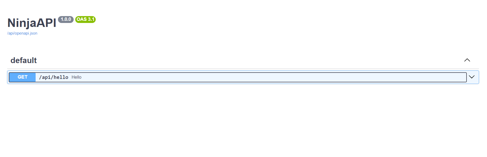

# Django Ninja

Django Ninja é um framework para construção de APIs RESTful com Django, que é uma ferramenta muito poderosa para desenvolvimento web. Ele é muito fácil de usar e possui uma documentação muito boa.

Para instalar o Django Ninja é necessário rodar o comando abaixo:

```powershell
pip install django-ninja
```

## Adicionando o Django Ninja ao projeto

Agora que o Django Ninja está instalado, vamos adicionar ele ao nosso projeto Django.

Para isso, é necessário abrir o arquivo `settings.py` do projeto e adicionar o app `ninja` na lista de `INSTALLED_APPS`:

```python
INSTALLED_APPS = [
    ...
    'ninja',
]
```

Agora o Django Ninja está adicionado ao projeto e pronto para ser utilizado.

## Criando uma API com Django Ninja

Para que possamos nos familiarizar com o Django Ninja, vamos criar uma API simples que retorna um hello world.

Iremos no arquivo `urls.py` do projeto e adicionar o seguinte código:

```python
from ninja import NinjaAPI

api = NinjaAPI()

@api.get("/hello")
def hello(request):
    return {"message": "Hello World!"}
```

Agora, para que a API seja acessível, é necessário adicionar a rota da API no arquivo `urls.py` do projeto:

```python
from django.urls import path
from ninja import NinjaAPI

api = NinjaAPI()

@api.get("/hello")
def hello(request):
    return {"message": "Hello World!"}

urlpatterns = [
    path("admin/", admin.site.urls),
    path("api/", api.urls),
]
```

Agora, para acessar a API, basta acessar a URL `http://localhost:8000/api/hello`.



Aqui está a documentação da API gerada automaticamente pelo Django Ninja.
