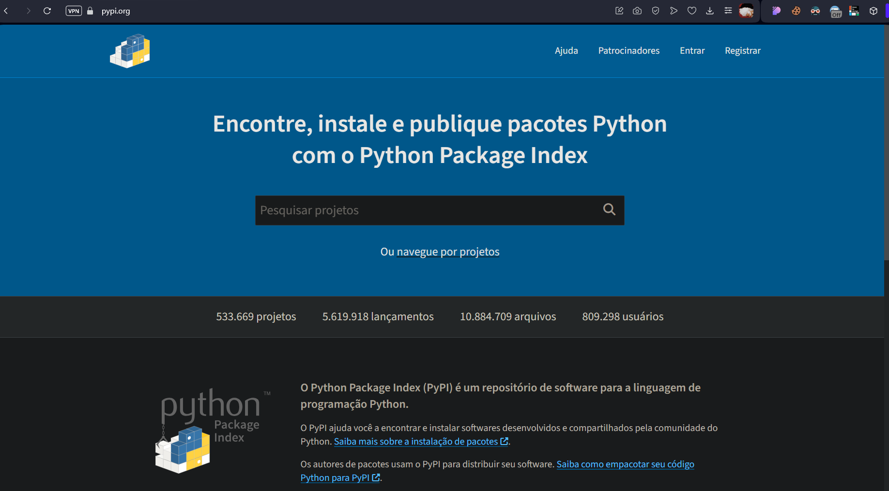

# Comando e Base de Conhecimento

### Inicando um projeto python

Para iniciar um projeto python uma boa prática é criar um ambiente virtual, para isso é necessário rodar o comando abaixo:

```powershell
python3 -m venv venv
```

ou

```powershell
py -m venv venv
```

Depois de criar o ambiente virtual é necessário ativa-lo, para isso é necessário rodar o comando abaixo:

```powershell
./venv/Scripts/activate.Ps1
```

ou

```cmd
.\venv\Scripts\activate.bat
```

Para saber se o ambiente virtual foi ativado é só verificar se o nome do ambiente virtual aparece no inicio da linha de comando.

```powershell
(venv) PS C:\Users\user\Documents\GitHub\ComandoBase>
```

Para desativar o ambiente virtual é necessário rodar o comando abaixo:

```powershell
deactivate
```

### Bibliotecas Python

Agora nós iremos conhecer o PIP(Python Install Package), que é um gerenciador de pacotes do Python. Com ele é possível instalar, desinstalar e atualizar pacotes ou bibliotecas do Python.


Agora vamos ver alguns comandos básicos do PIP:

- Para instalar uma biblioteca é necessário rodar o comando abaixo:

```powershell
pip install nome_da_biblioteca
```

- Para instalar uma versão específica de uma biblioteca é necessário rodar o comando abaixo:

```powershell
pip install nome_da_biblioteca==versão
```

- Para desinstalar uma biblioteca é necessário rodar o comando abaixo:

```powershell
pip uninstall nome_da_biblioteca
```

- Para atualizar uma biblioteca é necessário rodar o comando abaixo:

```powershell
pip install --upgrade nome_da_biblioteca
```

- Para listar todas as bibliotecas instaladas é necessário rodar o comando abaixo:

```powershell
pip list
```

- Para listar todas as bibliotecas instaladas e suas versões é necessário rodar o comando abaixo:

```powershell
pip freeze
```

- Para salvar todas as bibliotecas instaladas e suas versões em um arquivo de requisitos é necessário rodar o comando abaixo:

```powershell
pip freeze > requirements.txt
```

- Para instalar todas as bibliotecas de um arquivo de requisitos é necessário rodar o comando abaixo:

```powershell
pip install -r requirements.txt
```

### Django

Agora que ja sabemos iniciar um projeto python e instalar bibliotecas, vamos conhecer o Django, que é um framework web de alto nível escrito em Python que incentiva o desenvolvimento rápido e limpo. Com o Django é possível criar aplicações web de forma rápida e fácil.
Para instalar o Django é necessário rodar o comando abaixo:

```powershell
pip install django
```

Para criar um projeto Django é necessário rodar o comando abaixo:

```powershell
django-admin startproject nome_do_projeto
```

se rodar o comando para iniciar o projeto Django mas indicando o diretório onde o projeto será criado, é necessário rodar o comando abaixo:

```powershell
django-admin startproject nome_do_projeto .
```

A estrutura de um projeto Django é a seguinte:

```
nome_do_projeto/
    manage.py
    nome_do_projeto/
        __init__.py
        settings.py
        urls.py
        asgi.py
        wsgi.py
```

- O arquivo `manage.py` é um utilitário de linha de comando que permite interagir com o projeto Django ele será usado para rodar o servidor de desenvolvimento, criar aplicações, entre outras coisas.

- O diretório `nome_do_projeto` é o pacote Python para o projeto Django, ele é o pacote que será importado para o Python para interagir com o projeto. Para que a pasta `nome_do_projeto` seja reconhecida como um pacote Python é necessário criar um arquivo `__init__.py` dentro dela. o arquivo `__init__.py` é obrigatório para que o Python reconheça a pasta como um pacote.

- O arquivo `settings.py` é o arquivo de configuração do projeto Django, nele é possível configurar o banco de dados, a aplicação de autenticação, a aplicação de administração, entre outras coisas.

- O arquivo `urls.py` é o arquivo de configuração de rotas do projeto Django, nele é possível configurar as rotas do projeto.

- O arquivo `asgi.py` é o arquivo de configuração do ASGI(Application Server Gateway Interface), ele é usado para configurar o servidor ASGI.

- O arquivo `wsgi.py` é o arquivo de configuração do WSGI(Web Server Gateway Interface), ele é usado para configurar o servidor WSGI.

Para rodar o servidor de desenvolvimento do Django é necessário rodar o comando abaixo:

```powershell
python manage.py runserver
```
